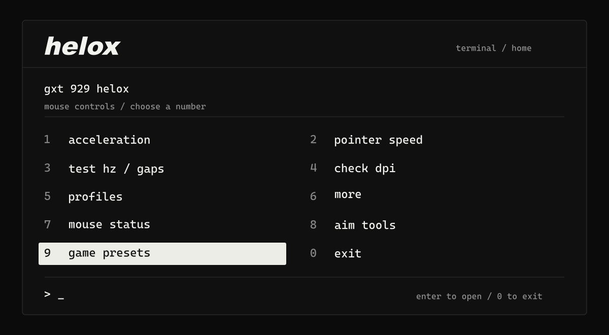

**[download](https://github.com/maximkochergin/helox-terminal/releases/latest)** &nbsp; / &nbsp; [manual](docs/manual.md) &nbsp; / &nbsp; [releases](https://github.com/maximkochergin/helox-terminal/releases)

## start

mouse controls for windows 10/11. a numbered terminal menu, launched from a batch file.

1. extract the release zip and open `launch.bat`.
2. select your mouse in `6 more → 1 choose mouse`.
3. open `1 game setup` for a complete setup, or `2 tune mouse` to tune your own curve.



opening helox leaves settings unchanged. no account, telemetry or background app.

## controls

| control | action |
| --- | --- |
| pointer | windows speed, acceleration, scrolling and buttons |
| input | delivered hz, report timing, gaps and known-distance dpi estimation |
| aim tools | personal acceleration curves, filter previews and selected-mouse bypass |
| game presets | complete driver setups for valorant, cs2 and matched kovaak's practice |
| profiles | saved windows settings, previews and undo |
| maintenance | driver checks, recovery, uninstall and data cleanup |

[aim setup](docs/manual.md#aim-tools) &nbsp; / &nbsp; [curves](docs/curves.md) &nbsp; / &nbsp; [game presets](docs/game-presets.md) &nbsp; / &nbsp; [movement checks](docs/movement.md)

## compatibility

input measurement uses mice exposed through windows raw input. aim tools use the optional raw accel driver and apply to the selected device; windows pointer settings apply to the desktop. game sensitivity and fov stay manual.

hardware dpi, configured polling rate and battery are not read automatically. measured hz is delivered input frequency; dpi calibration is an estimate. vendor-specific hardware controls depend on a verified device protocol.

<details>
<summary>setup and recovery</summary>

basic features use .net framework 4.x. aim tools require 64-bit windows, the raw accel prerequisites, administrator rights for installation and a restart. [installation](docs/manual.md#aim-tools).

after reboot, use `2 tune mouse → 3 driver → 3 resume saved` to restore saved aim choices. if an active built-in curve has lost its saved controls, `2 → 3 → 7 recover saved controls` can recognize it without changing the driver. `preset status` checks which recipe matches the live driver. interrupted preset/filter writes keep a recovery snapshot; close games and use `1 game setup → 5 undo or recover` or `preset recover`.

known-distance dpi estimation is available through `calibrate <cm>`. the mouse-body shortcut in `3 test mouse → 3 dpi estimate` currently uses verified gxt 929 dimensions only. [measurement details](docs/manual.md#tests-and-recovery).

settings and backups stay in `%localappdata%\helox-terminal`. [driver removal and cleanup](docs/manual.md#driver-checks-and-removal).

</details>

<details>
<summary>commands</summary>

```text
launch.bat status --json
launch.bat health
launch.bat health --mouse 0 --json
launch.bat measure 10 --json
launch.bat calibrate 20
launch.bat preset status
launch.bat preset preview cs2 steady
launch.bat aim response
launch.bat aim resume
launch.bat check
```

`help` lists every command. [full reference](docs/manual.md#advanced-commands).

</details>

<details>
<summary>build and test</summary>

```powershell
powershell.exe -noprofile -executionpolicy bypass -file .\build.ps1
powershell.exe -noprofile -executionpolicy bypass -file .\tests\run.ps1
```

the launcher builds if the executable is missing. rebuild after source changes.

the full tests temporarily change windows preferences and restore them; `check` does not apply settings. `tests\live.ps1` separately verifies actual driver writes, recipe apply/undo and failure recovery with games closed. [verification](docs/verification.md).

</details>

[hardware research](docs/hardware.md) &nbsp; / &nbsp; [aim research](docs/aim.md)

[mit licensed](LICENSE). use, modify and redistribute with the copyright and license notice retained. supplied without warranty. the optional raw accel package retains its own mit license.
